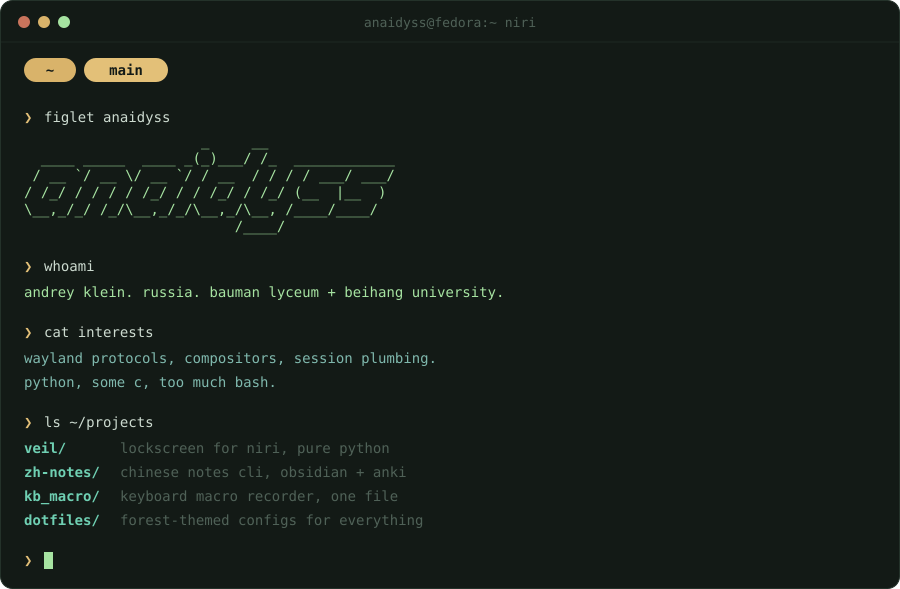

  

## projects

### [veil](https://github.com/anaidyss/veil)

a lockscreen for niri on ext-session-lock-v1, in pure python
(pywayland + pillow + PAM). the compositor holds the lock session, so
kill won't save you. fake audit log at the bottom because it looks cool.

  

### [kb_macro](https://github.com/anaidyss/kb_macro)

global keyboard macro recorder in one python file. evdev grabs your
keyboards, uinput replays them at 2x. works everywhere: terminal,
browser, games. `Ctrl+Alt+R` to record, `Ctrl+Alt+P` to play.

## setup

niri on fedora, jetbrains mono everywhere. every app themed to one
forest palette: [dotfiles](https://github.com/anaidyss/dotfiles).

email is in git log if you need me.
